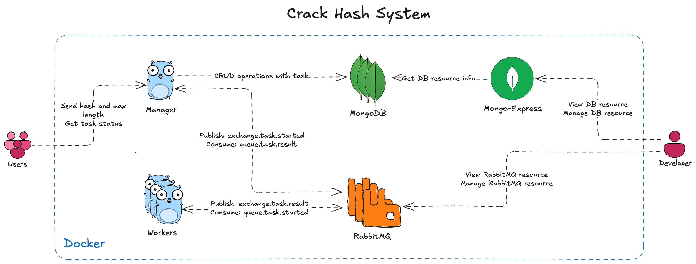

<h1 align="center">Crack Hash</h1>

<p align="center">
  
  
  
  
</p>

Distributed system for cracking MD5 hashes

## Architecture



## Draw.io

See [arch.drawio](./.assets/arch.drawio)

## Quickstart

### Requirements

- Golang 1.23.5
- Docker
- Docker Compose
- Make (optional)

### Clone repository

```bash
git clone https://github.com/ptrvsrg/crack-hash.git
```

### Running

#### Docker

```bash
docker compose -f ./deploy/docker/docker-compose.stable.yaml up -d --force-recreate --build
```

#### Manually

See [manager](./manager/README.md) and [worker](./worker/README.md)

## License

This project is distributed under the [Apache 2.0](https://www.apache.org/licenses/LICENSE-2.0.html) license